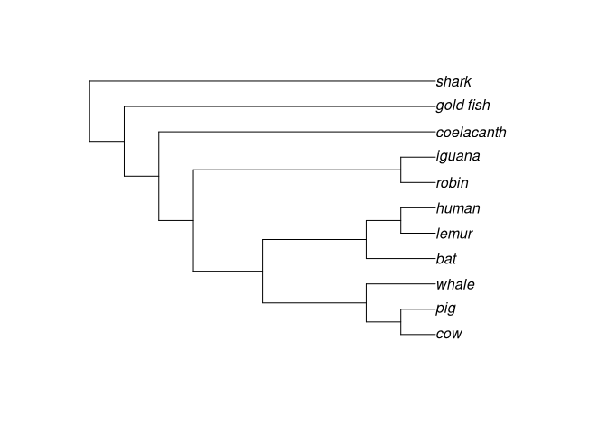
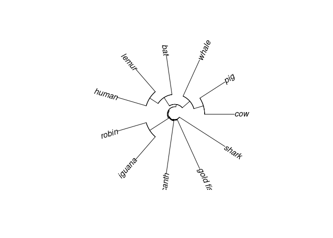

<!-- README.md is generated from README.Rmd. Please edit that file -->

Análise Filorgenética Comparativa
=================================

### Disciplina oferecida pelo [PPGFAP-UFSC](https://ppgfap.posgrad.ufsc.br/)

<!-- badges: start -->

<!-- badges: end -->

Integração, manipulação e visualização de dados filogenéticos
=============================================================

Neste [livro online](https://yulab-smu.top/treedata-book/index.html) se
encontra um guia para integração, manipulação e visualização de dados
filogenéticas através da [filosofia
`tidyverse`](https://tidyverse.tidyverse.org/articles/manifesto.html),
usando os pacotes [R](https://www.r-project.org):
[tidytree](https://CRAN.R-project.org/package=tidytree),
[treeio](https://doi.org/10.1093/molbev/msz240) e
[ggtree](https://doi.org/10.1111/2041-210X.12628).

Os exemplos e tutorias apresentado na disciplina serão convertidos e
executados com base neste três pacotes.

1.  Tutoriais/Tutorial filogenias no R-em português(Suzana)/Tutorial
    phylo R(SAlcantara).txt (as partes de uso básico ao `R` não serão
    apresentadas aqui)

    -   Lista de pacotes que serão/poderão ser usados na disciplina:

        [ade4](https://cran.r-project.org/web/packages/ade4/index.html "ade4"),
        [ape](https://cran.r-project.org/web/packages/ape/index.html),
        [geiger](https://cran.r-project.org/web/packages/geiger/index.html),
        [diversitree](https://cran.r-project.org/web/packages/diversitree/index.html),
        [picante](https://cran.r-project.org/web/packages/picante/index.html),
        [phyloclim](https://cran.r-project.org/web/packages/phyloclim/index.html),
        [vegan](https://CRAN.R-project.org/package=vegan),
        [foreign](https://CRAN.R-project.org/package=foreign),
        [nlme](https://CRAN.R-project.org/package=nlme),
        [BAMMtools](https://cran.r-project.org/web/packages/BAMMtools/index.html)
        e
        [phytools](https://cran.r-project.org/web/packages/phytools/index.html).

        Listas importantes e sempre atualizadas: [análises filogenéticas
        comparativas](https://cran.r-project.org/web/views/Phylogenetics.html)

> para arquivos de texto, utilize o programa
> [TextWrangler](https://www.techtudo.com.br/tudo-sobre/textwrangler.html)
>
> de preferência, salve os dados originais (planilhas de excel) em
> formato .csv (sem fórmulas ou caracteres especiais, use . para casa
> decimais)

##### QUARTA LIÇÃO: aprender a manipular filogenias em R

comandos úteis: `read.tree()`, `branching.times()`, `node.depth()`,
`cophenetic.phylo(),` `vcv()`, `write.tree()`, `mrca()`, `multi2di()`,
`rotate()`

Plotar: `plot.phylo()` , `add.scale.bar()` , `identify.phylo()` ,
`nodelabels()` , `subtreeplot()` , `which.edge()` , `zoom()`

##### Tutorial filogenias-intro:

##### Usando os pacotes indicados nos tutoriais

    library(ape)
    library(geiger)
    library(phytools)
    #> Loading required package: maps

    ##ler árvore de uma linha (objeto criado: lista de classe phylo):

    tt = "(((((((cow, pig),whale),(bat,(lemur,human))),(robin,iguana)),coelacanth),gold_fish),shark);"

    vert.tree <- read.tree(text = tt)

    #plotar em diferentes formatos:
    plot(vert.tree)

    # Cladograma
    plot(vert.tree,type="cladogram")

    # Sem raiz
    plot(unroot(vert.tree),type="unrooted")

    # Fan
    plot(vert.tree,type="fan")

##### Usando os pacotes ‘tidy’ `treeio` e `ggtree`

    # carregando o pacote 'treeio'
    library(treeio)
    #> Registered S3 method overwritten by 'treeio':
    #>   method     from
    #>   root.phylo ape
    #> treeio v1.12.0  For help: https://yulab-smu.github.io/treedata-book/
    #> 
    #> If you use treeio in published research, please cite:
    #> 
    #> LG Wang, TTY Lam, S Xu, Z Dai, L Zhou, T Feng, P Guo, CW Dunn, BR Jones, T Bradley, H Zhu, Y Guan, Y Jiang, G Yu. treeio: an R package for phylogenetic tree input and output with richly annotated and associated data. Molecular Biology and Evolution 2020, 37(2):599-603. doi: 10.1093/molbev/msz240
    #> 
    #> Attaching package: 'treeio'
    #> The following object is masked from 'package:phytools':
    #> 
    #>     read.newick
    #> The following object is masked from 'package:geiger':
    #> 
    #>     treedata
    #> The following object is masked from 'package:ape':
    #> 
    #>     drop.tip

    tt1 <- "(((((((cow, pig),whale),(bat,(lemur,human))),(robin,iguana)),coelacanth),gold_fish),shark);"

    vert_tree <- read.newick(text = tt1)

    ## carregando o pacote 'ggtree'
    library(ggtree)
    #> ggtree v2.2.4  For help: https://yulab-smu.github.io/treedata-book/
    #> 
    #> If you use ggtree in published research, please cite the most appropriate paper(s):
    #> 
    #> - Guangchuang Yu. Using ggtree to visualize data on tree-like structures. Current Protocols in Bioinformatics, 2020, 69:e96. doi:10.1002/cpbi.96
    #> - Guangchuang Yu, Tommy Tsan-Yuk Lam, Huachen Zhu, Yi Guan. Two methods for mapping and visualizing associated data on phylogeny using ggtree. Molecular Biology and Evolution 2018, 35(12):3041-3043. doi:10.1093/molbev/msy194
    #> - Guangchuang Yu, David Smith, Huachen Zhu, Yi Guan, Tommy Tsan-Yuk Lam. ggtree: an R package for visualization and annotation of phylogenetic trees with their covariates and other associated data. Methods in Ecology and Evolution 2017, 8(1):28-36. doi:10.1111/2041-210X.12628
    #> 
    #> Attaching package: 'ggtree'
    #> The following object is masked from 'package:ape':
    #> 
    #>     rotate

    # Visualizar
    ggtree(vert_tree) + 
      geom_tiplab(size=3, color="red")

    # O tipo de árvore é alterado pelo argumento 'layout'

    # Circular
    ggtree(vert_tree, layout="circular") + 
      geom_tiplab(size=3, color="purple")

    # Inclinada
    ggtree(vert_tree, layout="slanted") + 
      geom_tiplab(size=3, color="blue")

    # Sem raiz
    ggtree(vert_tree, layout="daylight") + 
      geom_tiplab(size=3, color="red")
    #> Average angle change [1] 0.111110129900635
    #> Average angle change [2] 0.0369310900693604

objeto de classe phylo tem 4 partes, normalmente “escondidas” (não
aparecem quando digitamos o nome do objeto):

    vert.tree
    #> 
    #> Phylogenetic tree with 11 tips and 10 internal nodes.
    #> 
    #> Tip labels:
    #>   cow, pig, whale, bat, lemur, human, ...
    #> 
    #> Rooted; no branch lengths.

Independentemente do pacote que o criou:

    vert_tree
    #> 
    #> Phylogenetic tree with 11 tips and 10 internal nodes.
    #> 
    #> Tip labels:
    #>   cow, pig, whale, bat, lemur, human, ...
    #> 
    #> Rooted; no branch lengths.

    #para ver todas as partes:
    str(vert.tree)
    #> List of 3
    #>  $ edge     : int [1:20, 1:2] 12 13 14 15 16 17 18 18 17 16 ...
    #>  $ Nnode    : int 10
    #>  $ tip.label: chr [1:11] "cow" "pig" "whale" "bat" ...
    #>  - attr(*, "class")= chr "phylo"
    #>  - attr(*, "order")= chr "cladewise"

    str(vert_tree)
    #> List of 3
    #>  $ edge     : int [1:20, 1:2] 12 13 14 15 16 17 18 18 17 16 ...
    #>  $ Nnode    : int 10
    #>  $ tip.label: chr [1:11] "cow" "pig" "whale" "bat" ...
    #>  - attr(*, "class")= chr "phylo"
    #>  - attr(*, "order")= chr "cladewise"

outro exemplo com os pacotes do tutorial:

    tree1 <- read.tree(text = "(((A,B),(C,D)),E);")

    plot(tree1, type = "cladogram", edge.width = 2)

mesmo exemplo com os pacotes ‘tidy’:

    tree2 <- read.newick(text = "(((F,G),(H,I)),J);")

    ggtree(tree2, branch.length='none') +
      geom_tiplab(size=3, color="red")

objeto phylo com 3 componentes (=explicados a seguir) e uma classe de
atributo (=phylo):

    tree1$edge
    #>      [,1] [,2]
    #> [1,]    6    7
    #> [2,]    7    8
    #> [3,]    8    1
    #> [4,]    8    2
    #> [5,]    7    9
    #> [6,]    9    3
    #> [7,]    9    4
    #> [8,]    6    5

A matrix edge contém o começo e o final do número do nó para todos os
nós e terminais da filogenia.

Por convenção, os terminais da árvore são numerados de 1 ao longo do
número n de terminais; e os nós são numerados n:- 1 ao longo do n + m
para m nós. m = n - 1 para as árvores totalmente bifurcadas.

O vetor tip.label contém os labels (=identificações) para todos os
terminais na árvore.

A ordem dos tip.label é a ordem dos terminais numerados de 1 a n no
vetor edge.

    tree1$tip.label
    #> [1] "A" "B" "C" "D" "E"

    tree2$tip.label
    #> [1] "F" "G" "H" "I" "J"

O numeral Nnode contém o número de nós internos da árvore, incluindo a
raiz da árvore.

    tree1$Nnode
    #> [1] 4

    tree2$Nnode
    #> [1] 4

para plotar todas as info:

    plot(tree1,edge.width = 2,label.offset = 0.1, type = "cladogram")
    nodelabels()
    tiplabels()

para plotar todas as info com os pacotes ‘tidy’:

    ggtree(tree2, branch.length='none') +
      geom_text(aes(label = node), color = "blue", size = 3, hjust = -.3) +
      geom_tiplab(size = 3, geom = "label", color="red", hjust = -.5)

“phylo” tb pode ter outros componentes, os mais comuns são `edge.length`
(um vetor de classe `numeric` contendo todos os comprimentos dos ramos
da árvore na mesma ordem em que as linhas no vetor edge; e `root.edge`,
um valor numérico dando o comprimento do ramo da raiz, se enraizada.

Outros elementos e atributos podem ser adicionados para tipos especiais
de árvores filogenéticas.

Escrevendo e lendo árvores filogenéticas:

    write.tree(tree1, "example1.tre")

    cat(readLines("example1.tre"))
    #> (((A,B),(C,D)),E);

utilizando phytools:

    writeNexus(tree1,"example1.nex")

    cat(readLines("example1.nex"),sep="\n")
    #> #NEXUS
    #> [R-package PHYTOOLS, Thu Oct  8 18:31:31 2020]
    #> 
    #> BEGIN TAXA;
    #>  DIMENSIONS NTAX = 5;
    #>  TAXLABELS
    #>      A
    #>      B
    #>      C
    #>      D
    #>      E
    #>  ;
    #> END;
    #> BEGIN TREES;
    #>  TRANSLATE
    #>      1   A,
    #>      2   B,
    #>      3   C,
    #>      4   D,
    #>      5   E
    #>  ;
    #>  TREE * UNTITLED = [&R] (((1,2),(3,4)),5);
    #> END;

Simulando, plotando, extraindo clados & cortando tips (terminais) das
árvores:

(escolher o valor de seed para garantir repetibilidade)

    set.seed(1)

simular uma árvore com modelo birth-death utilizando phytools

    tree <- pbtree(b = 1, d = 0.2, n = 40)

critério de parada é 40 espécies viventes, neste caso:

    plotTree(tree)
    nodelabels()

Utilizando os pacotes ‘tidy’

    ggtree(tree) +
      geom_nodelab(aes(label = node), colour = "blue", size = 2, hjust = .2) +
      geom_tiplab(colour = "red", size = 3, hjust = -.3)

ok, agora extraia o clado descendente a partir do nó de número 62

    tt62 <- extract.clade(tree, 62)
     
    plotTree(tt62)

Utilizando os pacotes ‘tidy’:

    # Note que o pacote `ggtree` possui a função `viewClade`, que mostra um clado
    # da árvore criada "tree" sem a necessidade de se extrair um subconjunto (tt62)
    # da árvore para então proceder a visualização. 

    p <- ggtree(tree) + geom_tiplab()

    viewClade(p, node = 62)

